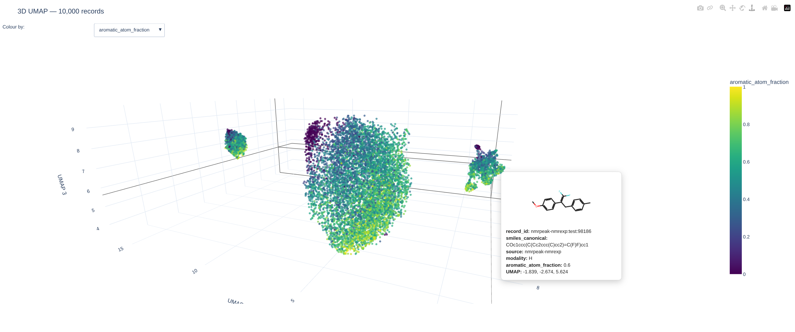

# FoMoNMR

FoMoNMR is a foundation encoder for structured, combined `1H + 13C` NMR
resonance lists. This repository contains the canonical data pipeline, the
FoMoNMR implementation, adapters for published baseline encoders, and the
downstream evaluations used in the project.

The code follows one consistent boundary:

```text
canonical dataset -> model-specific processor/collator -> native batch -> encoder
```

Canonical records remain model independent. Tokenization, padding, masking,
checkpoint limits, and pooling belong to the model that consumes them.

### Interactive embedding visualization

Explore the test-set embeddings in an interactive 3D UMAP:

[](https://nicogreeco.github.io/nmr_fomo/umap_3d_properties_test_images.html)

*Click the figure to explore the interactive 3D visualization.*

## Clone

The published model repositories are included as Git submodules. Clone them
with the project:

```bash
git clone --recurse-submodules git@github.com:nicogreeco/nmr_fomo.git
cd nmr_fomo
```

If you already cloned the repository, initialise them with:

```bash
git submodule update --init --recursive
```

The submodules are pinned to specific revisions so that the benchmark code is
reproducible. Do not update one casually: test the relevant benchmark path and
then commit the new submodule pointer in this repository.

## Published-model benchmarks

`models/` contains code from published repositories, used here only to extract
latent representations from their existing encoders as a benchmark.

| Local path | Published repository | Role here |
|---|---|---|
| `models/NMRPeak` | NMRPeak | peak-token encoder baseline |
| `models/NMRTrans` | NMRTrans | paired H/C peak-set encoder baseline |
| `models/NMR-Solver` | NMR-Solver | fixed Gaussian-spectrum featurizer |
| `models/UltraNMR` | UltraNMR | shift-only encoder baseline |

UniMol2 is the structure-only learned comparison. It is installed from
`unimol_tools` in its own environment and does not add a repository submodule.
Morgan ECFP4 is the fixed structure-only control and is generated directly from
`smiles_canonical` with RDKit (radius 2, 2,048 bits).

Each checkpoint, dataset release, and model asset must be downloaded according
to the instructions and licence in that model's own upstream README. They are
large local assets and are deliberately not versioned here.

## Environments and local assets

### Main environment only

Most work in this repository needs only the main environment: canonical data
conversion, DVC, FoMoNMR training and inference, and analysis of already
extracted embedding Parquets. With [uv](https://docs.astral.sh/uv/), create it
directly in the checkout:

```bash
uv venv --python 3.11 .venv
uv pip install --python .venv/bin/python --torch-backend auto "torch==2.6.0"
uv pip install --python .venv/bin/python -r scripts/envs_scr/requirements/nmr-main.txt
```

Use `--torch-backend cpu` instead of `auto` on a CPU-only machine. Activate
the environment with `source .venv/bin/activate`.

### Published-model embedding extraction

The main environment is enough until you need to reproduce embeddings from the
published benchmark models. Their upstream dependencies are not all compatible,
so use the environment setup scripts for that step:

```bash
./scripts/envs_scr/setup_cpu_envs.sh /path/to/nmr-envs
# or, on a prepared GPU VM:
./scripts/envs_scr/setup_gpu_envs.sh /path/to/nmr-envs
```

They can also install only the environment needed for one model, for example
`--only nmrpeak` or `--only unimol2`. See
[scripts/envs_scr/README.md](scripts/envs_scr/README.md) for exact setup,
activation, and repair commands.

## Quick start: extract FoMoNMR embeddings

Download the standard posttraining checkpoint and the public benchmark test
set from Hugging Face:

```bash
hf download niccogreek/fomonmr \
  posttraining/fomonmr-posttrain.ckpt \
  --local-dir models_release

hf download niccogreek/nmr-canonical-cleaned \
  test_benchmark.parquet \
  --repo-type dataset \
  --local-dir datasets/cleaned
```

`CanonicalParquetDataset` streams model-independent records from the Parquet.
`FoundationNMRProcessor` validates and pads a batch, builds the availability
masks, and converts it to the tensors expected by FoMoNMR. Run the example from
the repository root with `scripts` on `PYTHONPATH`, for example as
`PYTHONPATH=scripts python example.py`:

```python
import torch
from torch.utils.data import DataLoader

from data import CanonicalParquetDataset
from model import FoundationNMRProcessor
from model.FoMoNMR import FoMoNMR

dataset = CanonicalParquetDataset(
    "datasets/cleaned/test_benchmark.parquet"
)
loader = DataLoader(
    dataset,
    batch_size=8,
    num_workers=0,
    collate_fn=FoundationNMRProcessor(),
)

model = FoMoNMR.load_from_checkpoint(
    "models_release/posttraining/fomonmr-posttrain.ckpt",
    map_location="cpu",
    weights_only=True,
)
model.eval()

batch = next(iter(loader))
with torch.inference_mode():
    embeddings, peak_states, peak_mask = model(batch)

print(embeddings.shape)  # torch.Size([8, 512])
```

To encode the complete Parquet and save one embedding per `record_id`, use the
streaming extractor:

```bash
PYTHONPATH=scripts python -m model_benchmarks.extract_embeddings \
  --model fomonmr \
  --checkpoint models_release/posttraining/fomonmr-posttrain.ckpt \
  --input-mode rich \
  --input datasets/cleaned/test_benchmark.parquet \
  --output embeddings/fomonmr-post-rich/test.parquet \
  --device cpu --batch-size 32
```

The standard posttraining checkpoint uses the rich proton annotations that are
available in each record. Local record construction is documented in
[scripts/data/README.md](scripts/data/README.md); shift-only inference and
training are covered by [scripts/model/README.md](scripts/model/README.md), and
the complete extraction interface by
[scripts/model_benchmarks/README.md](scripts/model_benchmarks/README.md).

## Repository map

```text
datasets/                   workspace for downloaded sources, DVC outputs, and released data
docs/                       project report and standalone visual material
models/                     pinned upstream repositories (Git submodules)
results/                    tracked result CSVs, notebooks, and reproduction notes
scripts/
  data/                     canonical data code and data-preparation utilities
    canonicalize/           source-specific conversion and dataset-analysis tools
    postprocess/            derived-data and benchmark-preparation utilities
    download_raw_datasets.sh  pinned public-source downloader
  model/                    dataset, collator, and new foundation-model code
  model_benchmarks/         processors, embedders, downstream runners, and fine-tuning
  envs_scr/                 model-specific environment setup material
```

See [scripts/model/README.md](scripts/model/README.md) for checkpoint loading,
inference, and training examples. Canonical schema and reader examples are in
[scripts/data/README.md](scripts/data/README.md).

## Datasets

The final processed collection is public on
[Hugging Face](https://huggingface.co/datasets/niccogreek/nmr-canonical-cleaned).
It contains the cleaned rich pretraining and benchmark Parquets, SimNMR and
NMRGym shift-only pools, five property cohorts (AqSolDB, LD50 Zhu, Ames,
AstraZeneca lipophilicity, and Sangster logP), molecular-property Parquets,
and analytics. Most users should download it directly:

```bash
hf download niccogreek/nmr-canonical-cleaned \
  --repo-type dataset \
  --local-dir datasets/cleaned
```

To create the molecule-safe train/validation files used by FoMoNMR from the
published release, run the two split utilities directly:

```bash
PYTHONPATH=scripts python -m data.postprocess.split_foundation_datasets
PYTHONPATH=scripts python -m data.postprocess.split_maccs_probe \
  datasets/train_splits/rich_val.parquet \
  datasets/train_splits/rich_val_mol_properties.parquet
```

The first stage creates `datasets/train_splits/`; the second creates the fixed
MACCS probe split from rich validation. These commands use the cleaned NMR and
molecular-property Parquets downloaded from Hugging Face without changing the
root DVC lock.

To reproduce or modify the collection, activate the main environment, download
the pinned raw sources, then let DVC rebuild the complete graph:

```bash
scripts/data/download_raw_datasets.sh all
dvc repro
```

The downloader obtains the public upstream releases and verifies them against
the committed DVC pointers. `dvc repro` then runs canonicalization, merging,
overlap removal, filtering, ADMET preparation, molecular properties, and
analytics. The raw SimNMR LMDB is roughly 400 GB. The full rebuild uses up to
eight CPU workers (four for SimNMR canonicalization), took about 15 hours in a
successful run, and should be budgeted for up to 20 hours on a comparable
machine, excluding raw-download time.

See [datasets/README.md](datasets/README.md) for the directory layout and why
some folders are empty in a clean checkout, and
[scripts/data/README.md](scripts/data/README.md) for the Python data API and
pipeline tools.

## Results

The tracked result folders contain compact CSV outputs, analysis notebooks,
and instructions for reproducing each evaluation:

| Directory | Contents |
| --- | --- |
| [`results/ablation`](results/ablation) | FoMoNMR architecture and objective ablations |
| [`results/structural_information`](results/structural_information) | frozen structural-information probes |
| [`results/property_prediction`](results/property_prediction) | frozen ADMET probes across molecular, NMR, and combined representations |
| [`results/fomonmr_finetune`](results/fomonmr_finetune) | end-to-end FoMoNMR ADMET fine-tuning |

Each maintained result README identifies the dataset, embeddings, runner, and
notebook needed to regenerate its tables.

## Documentation

Each `scripts/` subfolder has a practical README for that part of the code.
Start from [scripts/README.md](scripts/README.md) to choose a workflow. Dataset
provenance and schema are documented in
[datasets/cleaned/README.md](datasets/cleaned/README.md), while each tracked
evaluation under `results/` includes its inputs and reproduction procedure.

A paper-style project report is in preparation and will be added under
[`docs/`](docs/README.md).

Before a push, check `git status`, `git diff --cached`, and
`git submodule status`.
